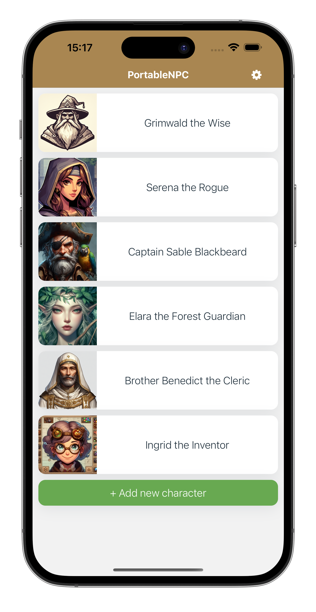
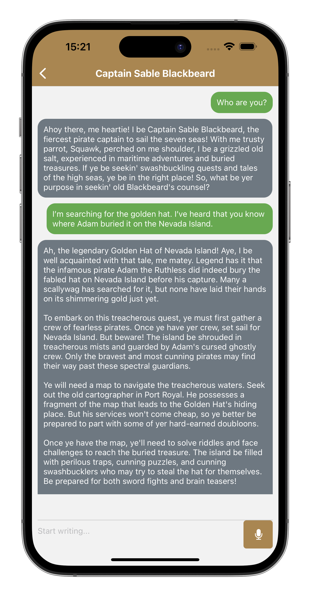

# PorableNPC

Mobile application simulating textual and voice interaction with NPCs in role-playing games. It is a subject of my engineering thesis.

It cooperates with the backend application [portable-npc-backend](https://github.com/szymonborda/portable-npc-backend)




## Development

* Install node v18 (if you already have other node version installed try using [nvm](https://github.com/nvm-sh/nvm))
  ```sh
  $ nvm install 18
  $ nvm use 18
  $ node --version
  v18.18.0
  ```
* Install yarn
  ```sh
  $ npm install -g yarn
  $ yarn --version
  1.22.19
  ```
* Install dependencies and start expo development server
  ```sh
  $ yarn
  $ yarn start
  ```
